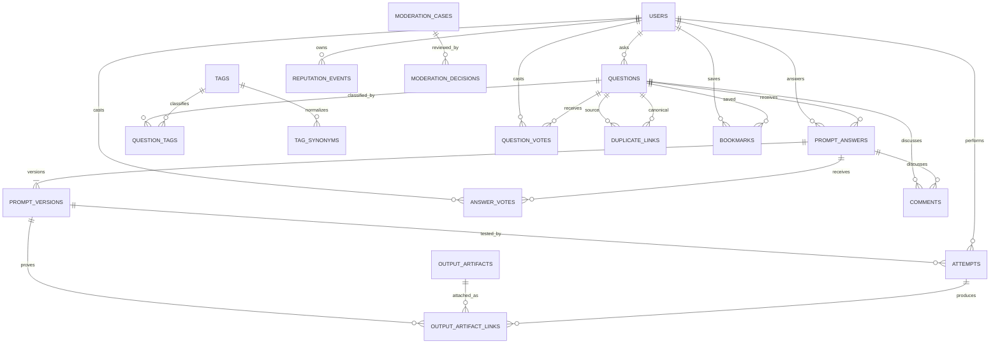
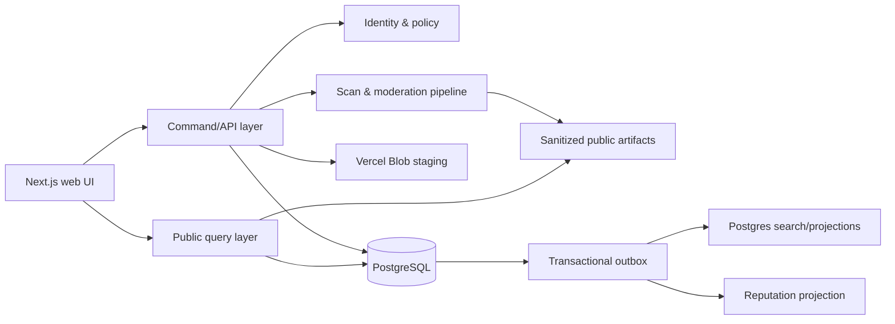

# ALIPROMPT Prompt Knowledge Network — Domain & Data Model

`decision_id: AP-PDN-001`  
`artifact_status: target_design`  
`runtime_status: not_implemented_by_this_artifact`

## 1. Bounded contexts

| Context | Trách nhiệm | Không sở hữu |
|---|---|---|
| Identity & Trust | user, profile, verification, suspension | nội dung tri thức |
| Knowledge | Question, Answer, Version, Comment, Accept | payment |
| Evidence | Output Artifact, Attempt, model run metadata | moderation verdict |
| Taxonomy & Discovery | tag, synonym, search, duplicate candidate | quyền publish |
| Community Governance | vote, reputation ledger, privilege | product pricing |
| Trust & Safety | report, review queue, moderation case, audit | ranking business goal |
| Commerce | product, order, payment, entitlement của ALIPROMPT | contributor payout |

Giữ Commerce tách khỏi Community Knowledge để reputation không trở thành tiền và contributor không vô tình có commerce authority.

## 2. Aggregate ownership

- **Question aggregate:** question, question tags, accepted answer reference, duplicate links.
- **Answer aggregate:** prompt answer, prompt versions, author output evidence.
- **Attempt aggregate:** một lần thử một prompt version và các output của lần thử.
- **Moderation aggregate:** case, flags, review decisions và audit events.
- **Reputation aggregate:** append-only reputation events và materialized balance.

Mọi command chỉ thay đổi một aggregate chính trong transaction. Side effects như notification, search indexing và reputation projection chạy từ outbox/event sau commit.

## 3. Entity relationship model



## 4. Logical tables

### Identity

#### `users` — extend existing

- `id`, `email`, `password_hash`, `display_name`, `role`;
- add `status: active|limited|suspended|deleted`;
- add `email_verified_at`, timestamps;
- never expose `email` in public query DTO.

#### `public_profiles`

- `user_id PK/FK`, `handle UNIQUE`, `bio`, `avatar_key`;
- materialized counters: `reputation_total`, `helpful_answers`, `accepted_answers`, `verified_attempts`;
- counters are projections, not source of truth.

### Knowledge

#### `questions`

- `id`, `slug UNIQUE`, `author_id`;
- `title`, `goal`, `context`, `input_description`, `constraints`;
- `status: draft|pending|published|closed|duplicate|archived`;
- `accepted_answer_id NULL`, `duplicate_of_question_id NULL`;
- `view_count`, `answer_count`, `published_at`, timestamps;
- checks: duplicate requires canonical id; accepted answer must belong to the same question, enforced in service/trigger.

#### `prompt_answers`

- `id`, `question_id`, `author_id`;
- `summary`, `usage_instructions`;
- `current_version_id`, `status: draft|pending|published|rejected|archived`;
- materialized `vote_score`, `success_count`, `partial_count`, `failure_count`;
- `published_at`, timestamps.

#### `prompt_versions`

- `id`, `answer_id`, `version_number`;
- `prompt_body`, `variables_schema JSONB`;
- `tool_provider`, `model_name`, `model_version`, `run_settings JSONB`;
- `change_summary`, `created_by`, `created_at`;
- unique `(answer_id, version_number)`;
- published version is immutable; edits append a new version.

#### `comments`

- `id`, `author_id`, exactly one of `question_id` or `answer_id`;
- `body`, `status`, timestamps;
- comments do not accept solutions or carry prompt bodies intended as answers.

#### `post_revisions`

- `id`, `entity_type`, `entity_id`, `revision_number`;
- `editor_id`, `snapshot JSONB`, `reason`, `created_at`;
- public attribution; rollback creates a new revision instead of deleting history.

### Evidence

#### `output_artifacts`

- `id`, `owner_id`, `blob_key`, `sha256`;
- `kind: text|image|pdf|file`;
- `mime_type`, `bytes`, `width`, `height`, `page_count`;
- `alt_text`, `caption`;
- `scan_status: staged|scanning|clean|rejected|deleted`;
- `moderation_status: pending|approved|rejected`;
- extracted metadata is private by default; public variants use sanitized blobs.

#### `output_artifact_links`

- `id`, `artifact_id`;
- exactly one owner: `prompt_version_id` or `attempt_id`;
- `role: author_proof|attempt_result|reference_input`;
- `sort_order`;
- unique ownership/order constraints.

#### `attempts`

- `id`, `prompt_version_id`, `tester_id`;
- `outcome: success|partial|failed`;
- actual `tool_provider`, `model_name`, `model_version`;
- `input_summary`, `notes`, `ran_at`;
- `status: pending|published|rejected|withdrawn`;
- `independent` is derived as `tester_id != answer.author_id`, never trusted from client;
- abuse fingerprint and raw telemetry stay private.

### Taxonomy

#### `tags`

- `id`, `slug UNIQUE`, `name`, `description`;
- `kind: vertical|task|model|output|language`;
- `status: active|synonym|retired`, usage count, timestamps.

#### `question_tags`

- composite PK `(question_id, tag_id)`;
- maximum five active tags enforced by command service.

#### `tag_synonyms`

- `alias_tag_id UNIQUE`, `canonical_tag_id`, `approved_by`, timestamps.

#### `duplicate_links`

- `source_question_id`, `canonical_question_id`, `status`;
- `proposed_by`, `resolved_by`, timestamps;
- source and canonical cannot be equal; cycles must be rejected.

### Community governance

#### `question_votes` / `answer_votes`

- `user_id`, target id, `value: -1|1`, timestamps;
- unique user/target;
- server rejects self-vote;
- vote change emits compensating reputation events.

#### `reputation_events`

- `id`, `user_id`, `event_type`, `points`;
- `source_entity_type`, `source_entity_id`;
- `policy_version`, `causation_id UNIQUE`, `reversed_event_id NULL`;
- `created_at`;
- append-only. Balance = sum of valid events; projection may cache it.

#### `privilege_grants`

- `user_id`, `privilege_key`, `source: threshold|manual|role`;
- `policy_version`, `granted_at`, `revoked_at`, `reason`;
- MVP uses manual/role for sensitive privileges.

#### `bookmarks`

- `user_id`, `question_id`, `created_at`;
- unique user/question; private by default.

### Trust & Safety

#### `moderation_cases`

- `id`, `subject_type`, `subject_id`, `queue`;
- `reason`, `priority`, `status: open|in_review|resolved|appealed`;
- `opened_by`, `assigned_to`, timestamps;
- subject is validated by service because polymorphic DB FK is not available.

#### `moderation_decisions`

- `id`, `case_id`, `reviewer_id`;
- `decision: approve|edit_requested|reject|close|duplicate|restore|suspend`;
- `reason`, `evidence_refs JSONB`, `created_at`;
- immutable; reversal is a new decision.

#### `outbox_events`

- reliable side effects for search index, notification, counter projection and reputation projection;
- unique event id, aggregate id/version, payload, publication status.

## 5. State machines

### Question

```text
draft → pending → published → closed → published
                    ├──────→ duplicate
                    └──────→ archived
pending → draft (changes requested)
pending → archived (rejected, retained for audit)
```

### Prompt Answer

```text
draft → pending → published → archived
          ├────→ draft (changes requested)
          └────→ rejected
```

### Artifact

```text
staged → scanning → clean → moderation approved → public sanitized variant
                    └────→ rejected/deleted
```

Không được public blob gốc trước scan và moderation.

## 6. Commands and invariants

| Command | Invariant chính |
|---|---|
| `AskQuestion` | verified user, 1–5 canonical tags, no raw PII |
| `SharePrompt` | atomically creates Question + Answer + Version + author evidence |
| `AnswerQuestion` | question open/published, evidence clean before publish |
| `RevisePrompt` | append version; old attempts remain bound to old version |
| `AcceptAnswer` | caller owns question; answer belongs to question; one accepted |
| `VoteAnswer` | no self-vote; one reversible vote |
| `RecordAttempt` | binds exact version; outcome enum; independent derived server-side |
| `MarkDuplicate` | no self/cycle; canonical question remains discoverable |
| `ModerateSubject` | reviewer authorized; decision and audit written together |

## 7. Query models

Không trả database row trực tiếp cho UI. Dùng public DTO loại PII:

- `QuestionListItem`: title, tags, answer count, verified success count, last activity;
- `QuestionDetail`: question, ordered answers, accepted id, canonical duplicate links;
- `AnswerEvidenceSummary`: current version, author outputs, success/partial/fail counts by model;
- `PublicProfile`: handle, badges, reputation and contribution counts, never email;
- `ReviewQueueItem`: only reviewers receive private moderation metadata.

PostgreSQL full-text search đủ cho MVP. Vector search là LATER sau khi có query corpus và metric chứng minh lexical search không đủ.

## 8. Security, privacy and abuse controls

- authorization ở command/service layer và database constraints cho invariant có thể biểu diễn;
- MIME sniffing, extension allowlist, size/page/pixel cap, malware scan, decompression-bomb defense;
- strip EXIF/GPS và tạo sanitized derivative;
- signed upload URLs có short TTL; staged object cleanup;
- rate limit ask/answer/vote/attempt/report theo account và privacy-safe abuse key;
- CSRF/origin validation cho mutation; audit admin/moderator action;
- detect reciprocal voting, burst voting, account clusters và repeated artifact hash;
- không đưa raw prompt có secret hoặc private client data vào search/log/analytics.

## 9. Architecture target



MVP ưu tiên modular monolith trong Next.js/PostgreSQL. Không tách microservice khi chưa có scale/evidence vận hành yêu cầu.

## 10. Compatibility with current repository

Có thể giữ các bảng hiện tại trong migration window:

- `prompts` là legacy source, không phải long-term aggregate;
- `prompt_media` map sang `output_artifacts` + links;
- `prompt_reactions` map sang `answer_votes`;
- `favorites` map sang `bookmarks` của Question;
- `categories` map sang tag `kind=vertical`;
- `reports` map sang moderation cases;
- `products/orders/payment_events/entitlements` không đổi ownership.

Schema này là target design. Không sửa `db/schema.ts` hoặc migration production cho tới khi Architect chốt ADR, mapping được dry-run và gate tương ứng được reviewer chấp nhận.
