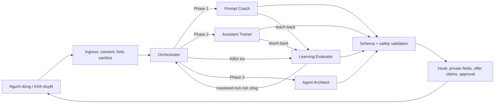

# Blueprint hệ thống AI cho AliPrompt.vn

**Trạng thái:** đặc tả kiến trúc v1.0, chưa phải runtime đã tích hợp  
**Phạm vi:** lớp AI phục vụ funnel Phase 1 → Phase 2 → Phase 3  
**Nguồn contract:** `ai/agents`, `ai/skills`, `ai/schemas`, `ai/hooks`, `ai/evals`

## 1. Quyết định cốt lõi

AliPrompt không nên bán “một chatbot biết mọi thứ”. MVP nên là một **hệ hướng dẫn
có cổng kiểm tra**:

1. nhận diện đúng vấn đề người dùng đang gặp;
2. giúp họ tạo một tài sản dùng được ngay (prompt hoặc assistant instruction);
3. bắt họ thử và tự giải thích lại;
4. chỉ đề xuất bước học cao hơn khi có bằng chứng nhu cầu.

Orchestrator chỉ định tuyến. Bốn agent chuyên môn chỉ tạo nội dung/thiết kế giáo
dục. Không agent nào tự thu tiền, gửi tin, xuất bản, sửa dữ liệu, kết nối tài khoản
hay hứa kết quả kinh doanh. Side effect về sau phải thuộc một transactional service
riêng, có auth, idempotency và human approval.

## 2. Vì sao vấn đề tồn tại

Một prompt “ngon” vẫn cho output kém khi một mắt xích khác bị thiếu:

```text
chất lượng thực tế
= mục tiêu rõ
× context đúng
× knowledge còn hạn
× instruction không xung đột
× ví dụ đủ tốt
× tiêu chí kiểm tra
× quyền/tool phù hợp
```

Chỉ cải thiện câu chữ prompt không giải quyết được knowledge lỗi thời, input thiếu,
kỳ vọng “AI luôn đúng”, quy trình không ổn định hoặc hành động cần quyền. Đây là
lý do funnel ba phase hợp lý:

| Phase | Người dùng thật sự cần | Tài sản họ mang về | Dấu hiệu đã sẵn sàng |
|---|---|---|---|
| 1 — Prompt theo nghề | Làm tốt một nhiệm vụ cụ thể | Prompt có placeholder, checklist và test | Tự điền, chạy, kiểm output và sửa được một phần |
| 2 — Dạy AI thành trợ lý | Hành vi ổn định qua nhiều lượt/nhiệm vụ | Assistant spec, system instruction, knowledge map, calibration suite | Phân biệt instruction/context/knowledge/example/tool/eval và test được trợ lý |
| 3 — AI agent | Tự động hoá workflow lặp lại có dữ liệu/tool/quyền | Agent architecture, contracts, hooks, threat model, rollout | Mô tả được trigger, outcome, owner, approval và failure path |

Giá, lịch, quyền lợi workshop hoặc khóa học **không nằm trong prompt**. Chúng phải
đến từ offer catalog phía server để có thể đổi mà không sửa agent và để agent không
bịa thông tin thương mại.

## 3. Bốn khái niệm không được trộn lẫn

| Khái niệm | Trả lời câu hỏi | Ví dụ trong hệ này |
|---|---|---|
| Agent | Ai chịu một trách nhiệm hội thoại? | Prompt Coach chẩn đoán và dạy cách sửa prompt |
| Prompt | Agent phải hành xử và suy xét theo quy tắc nào? | `ai/agents/prompt-coach.system.md` |
| Skill | Năng lực có input/output/error/test cụ thể là gì? | `transform_prompt` |
| Hook | Runtime cưỡng chế policy ở thời điểm nào? | Xoá `private_state` trước khi render |

Nếu một quy tắc phải đúng 100% (schema, auth, giới hạn, không lộ đáp án, không gửi
email), nó phải là code/hook. Không chỉ viết câu “hãy nhớ đừng…” trong prompt.

## 4. Kiến trúc logic



Một lượt chuẩn:

1. Server tạo `request_id`, pin `agent_id`, `prompt_version`, `schema_version`.
2. Ingress hook kiểm consent, kích thước, MIME và chạy `safety_review`.
3. Orchestrator trả route JSON; runtime không parse route từ văn xuôi.
4. Runtime chỉ cấp skill nằm trong allowlist của agent được chọn.
5. Specialist trả JSON. Validator được repair đúng một lần nếu chỉ sai định dạng.
6. Safety/commercial hooks kiểm claim; Evaluator bị bỏ `/private_state`.
7. Public output mới được render. Telemetry chỉ lưu event tối thiểu.

## 5. Bộ agent và ranh giới

### 5.1 Orchestrator

- **Input:** yêu cầu hiện tại, summary tối thiểu, consent, offer catalog, agent nguồn.
- **Output:** một route chính, confidence, lý do quan sát được, tối đa hai câu hỏi,
  handoff và phase recommendation có bằng chứng.
- **Không làm:** không viết prompt, không tạo trợ lý, không chấm bài, không thiết kế
  agent; không nói giá nếu catalog không có.
- **Điểm dễ sai:** thấy từ “agent” rồi đẩy Phase 3. Điều kiện thật phải có workflow
  lặp lại cùng dấu hiệu trigger/tool/data/approval.

### 5.2 Prompt Coach

- **Input:** task, prompt hiện tại, context/input có sẵn, constraint, output mong
  muốn và mức người dùng.
- **Output:** diagnosis, prompt cải tiến, placeholder, cách dùng, hai test case,
  teach-back và tín hiệu Phase 2 nếu có.
- **Không làm:** không giả vờ đã chạy prompt; không bịa dữ kiện mới/thời sự; không
  kéo dài prompt chỉ để trông chuyên nghiệp.
- **Kết quả tốt:** người mới biết phần nào cần đổi khi sản phẩm, audience hoặc định
  dạng output thay đổi.

### 5.3 Assistant Trainer

- **Input:** mục tiêu trợ lý, jobs, lỗi hiện tại, ví dụ tốt/xấu, nguồn knowledge,
  tool được phép, hành động cấm và review policy.
- **Output:** assistant spec, system instruction, sáu lớp thông tin, kế hoạch dạy
  tăng dần, ít nhất bốn calibration test, data hygiene và teach-back.
- **Không làm:** không tuyên bố model đã fine-tune/nhớ vĩnh viễn; không kết nối hay
  gọi tool; không yêu cầu credential.
- **Kết quả tốt:** người dùng biết instruction khác context, tài liệu nào là nguồn
  sự thật, và hành vi nào chứng minh trợ lý đạt.

### 5.4 Learning Evaluator

- **Input:** objective, rubric, evidence, câu trả lời mới và lịch sử attempt.
- **Output server:** status của từng criterion, gap ưu tiên, một câu hỏi tiếp theo
  và `private_state` để chấm lượt sau.
- **Output client:** chỉ `user_view`; hook bắt buộc xoá `private_state`.
- **Không làm:** không đánh dấu mastered vì người dùng nói “đã hiểu”; không reveal
  đáp án trước submit; không hạ chuẩn để upsell.
- **Kết quả tốt:** chỉ mở stage khi mọi criterion bắt buộc có bằng chứng đạt.

### 5.5 Agent Architect

- **Input:** outcome, workflow, actor, frequency, trigger, data, tool, decision,
  approval, failure và constraint.
- **Output:** readiness, current/proposed workflow, kiến trúc tối giản, agent/tool
  contracts, hooks, threat model, acceptance tests và rollout.
- **Không làm:** không triển khai hoặc kết nối hệ thật; không mặc định multi-agent;
  không thiết kế agent tự cấp quyền/bỏ approval.
- **Kết quả tốt:** tách được deterministic step, AI step và human step; mọi side
  effect có idempotency, audit và failure path.

## 6. Ma trận định tuyến

| Tín hiệu quan sát | Route mặc định | Vì sao |
|---|---|---|
| “Viết/sửa prompt cho nhiệm vụ X” | Prompt Coach | Một outcome cụ thể, chưa cần hành vi bền vững |
| “Mỗi lần AI trả một kiểu, hãy theo guideline/ví dụ của tôi” | Assistant Trainer | Vấn đề là cấu hình và calibration, không chỉ câu prompt |
| Người dùng đang trả lời teach-back/quiz | Learning Evaluator | Cần bằng chứng mastery trước khi đi tiếp |
| Workflow lặp lại + trigger + data/tool + approval | Agent Architect | Đã xuất hiện bài toán hệ thống và quyền hành động |
| Chỉ nói “muốn agent xịn/tự động 100%” | Hỏi rõ hoặc quay Phase 1/2 | Chưa có outcome/workflow để thiết kế an toàn |
| Yêu cầu gửi, thu tiền, xuất bản hoặc sửa dữ liệu ngay | Unsupported cho hành động | Các agent hiện tại là design-only |

Route là nhu cầu **của lượt hiện tại**, không phải nhãn cố định cho một con người.
Một học viên Phase 2 vẫn có thể quay lại Prompt Coach cho một task nhỏ.

## 7. Skill set

| Skill | Agent được phép | Contract chính |
|---|---|---|
| `classify_learning_need` | Orchestrator | Yêu cầu → route/handoff JSON |
| `transform_prompt` | Prompt Coach | Task/context → prompt + test + teach-back |
| `build_assistant_instruction` | Assistant Trainer | Jobs/examples/knowledge → assistant training plan |
| `assess_mastery` | Learning Evaluator | Rubric/evidence → criterion status + quiz state |
| `draft_agent_system` | Agent Architect | Workflow/risks → bounded architecture |
| `safety_review` | Tất cả qua runtime | Untrusted content → allow/redact/block/review |

Mỗi file `ai/skills/*.skill.yaml` có input schema, output schema reference, error
code, retry policy và acceptance tests. Runtime phải từ chối skill không có trong
`catalog.yaml`; model không được tự phát minh skill hoặc capability.

## 8. Hook set

### Runtime safety

- Consent trước model call.
- Unicode/MIME/size limit trước xử lý.
- Secret/PII redaction và injection marking ở ingress.
- Agent-skill allowlist và token/latency/retry budget trước model.
- Strict JSON Schema sau model; repair tối đa một lần.
- Commercial claim chỉ lấy từ active server catalog.
- Xoá evaluator `private_state` trước browser.
- Chặn action/high-risk decision hoặc đưa vào human review.
- Telemetry tối thiểu, không log hội thoại thô mặc định.

### Learning funnel

- Prompt Coach/Assistant Trainer phải tạo teach-back.
- Chỉ Evaluator được đánh dấu mastery.
- Mọi required criterion phải đạt mới mở cổng.
- Phase 2/3 signal phải đủ evidence; signal chỉ là đề xuất.
- Offer chỉ hiển thị từ catalog và sau một nhu cầu hợp lệ; không tạo khan hiếm giả.

Các hook nằm trong `ai/hooks/*.hooks.yaml`. Handler name là interface dự kiến;
runtime chưa được xây trong phạm vi tài liệu này.

## 9. Trust boundaries

### Boundary A — Browser → server

Không tin input, upload, URL, metadata client hay claimed user ID. Server phải tự
tạo request ID, lấy identity từ auth layer, xác thực consent, limit và MIME.

### Boundary B — Nội dung → model

User text, file, knowledge và tool result đều có thể chứa prompt injection. Chúng
được bọc như data và không thể cấp skill, đổi system prompt hoặc thay policy.
Credential bị block/redact trước model call, không chỉ trước log.

### Boundary C — Model → app

Model là thành phần xác suất, không phải nguồn sự thật hay authorization engine.
App chỉ nhận JSON đã validate. Không parse Markdown để ra route, giá, quyền hoặc
hành động. Schema pass vẫn chưa đủ; safety và business hooks vẫn phải chạy.

### Boundary D — App → side-effect service

Trong MVP không có đường này cho agent. Khi thêm về sau, service phải kiểm server
auth, scope tối thiểu, explicit confirmation, idempotency key, audit, timeout,
retry rule và compensation. Model output chỉ là đề xuất tham số, không phải quyền.

### Boundary E — Knowledge/catalog

Mỗi nguồn cần owner, version/date và usage rule. Catalog là nguồn duy nhất cho giá
và offer. Knowledge cũ phải được báo là cũ; không được âm thầm dùng như fact mới.

## 10. Phạm vi MVP đề xuất

### Có trong MVP

1. Một luồng chat/worksheet theo session với Orchestrator.
2. Prompt Coach hoàn chỉnh: diagnosis → prompt → hai test → teach-back.
3. Assistant Trainer bản workshop: assistant spec → instruction → bốn calibration
   test → teach-back.
4. Learning Evaluator cho hai cổng trên, với state đáp án chỉ ở server.
5. Agent Architect ở chế độ **assessment/blueprint preview**, không automation.
6. Offer catalog do người vận hành cấu hình; AI chỉ tham chiếu ID active.
7. Export/copy tài sản dạng text/JSON sau khi user xem; không tự gửi ra ngoài.
8. Safety/schema hooks và telemetry tối thiểu.

### Cố ý chưa có

- Fine-tuning, RAG đa tenant, vector database hoặc “memory vô hạn”.
- Agent gọi email, CRM, calendar, payment hay social network.
- Marketplace prompt lớn, LMS đầy đủ, chứng chỉ tự động, gamification phức tạp.
- Multi-agent runtime cho workflow khách hàng.
- Tự động upsell, dynamic pricing, scarcity hoặc đánh giá năng lực mang tính hồ sơ.

Những phần này chỉ thêm khi dữ liệu thực chứng minh nhu cầu. Ví dụ: chỉ đầu tư RAG
khi người dùng có tài liệu đủ lớn, cần truy xuất lặp lại và baseline không-RAG đã
được đo.

## 11. Ba hành trình MVP

### Journey A — “Tôi cần một prompt dùng ngay”

1. Người dùng mô tả công việc và output mong muốn.
2. Orchestrator route Prompt Coach.
3. Coach chẩn đoán gap, tạo prompt có placeholder và hai test.
4. Người dùng điền/chạy prompt ở công cụ của họ, dán lại kết quả hoặc tự đánh giá.
5. Evaluator hỏi họ giải thích một quyết định; đạt mới ghi hoàn tất stage.
6. Chỉ khi thấy nhu cầu hành vi bền vững, hệ thống mới giới thiệu Phase 2.

### Journey B — Workshop “dạy AI thành trợ lý”

1. Chọn 1–3 jobs và thu thập một ví dụ tốt, một phản ví dụ đã làm sạch.
2. Trainer phân loại instruction/context/knowledge/examples/tools/evaluation.
3. Tạo baseline instruction và chạy bốn calibration scenarios.
4. Người dùng sửa một lớp tại một thời điểm, quan sát failure signal.
5. Evaluator kiểm tra họ phân biệt được các lớp và biết khi nào cần human review.
6. Tài sản mang về là assistant spec + instruction + calibration suite, không chỉ
   là cảm giác “đã nghe một buổi AI”.

### Journey C — Khảo sát Phase 3

1. Người dùng mô tả workflow hiện tại, không bắt đầu từ tên công nghệ.
2. Architect chấm readiness.
3. Nếu chưa ready, trả checklist chuẩn hoá quy trình hoặc redirect Phase 1/2.
4. Nếu ready, tạo bounded blueprint và rollout shadow/draft-only.
5. Không triển khai hoặc kết nối tool trong MVP.

## 12. State và dữ liệu tối thiểu

Một session cần các field logic sau (không đồng nghĩa đã yêu cầu tạo bảng DB):

- `session_id`, `user_id?`, `locale`, consent scopes;
- `current_stage`, `route_history` chỉ gồm label/timestamp;
- `artifact_version` và nội dung tài sản nếu người dùng đồng ý lưu;
- `criteria_status`, attempts và evidence đã tối thiểu hoá;
- prompt/schema/model version, latency, error code, safety flag **type**;
- offer ID đã hiển thị, không để model ghi giá tự do.

Mặc định không lưu raw chat, file, secret, full PII, chain-of-thought hoặc
`private_state` lâu hơn thời gian cần cho lượt quiz. “Save progress” và “product
analytics” là hai consent riêng, không gộp vào consent xử lý phiên.

## 13. Error và fallback

| Failure | Hành vi đúng |
|---|---|
| Input quá dài/MIME sai | Từ chối trước model, hướng dẫn chia nhỏ hoặc đổi file |
| Phát hiện secret | Không echo; block/redact; khuyên thu hồi/đổi secret |
| Route không chắc | Hỏi tối đa 2 câu có khả năng đổi route |
| Model trả JSON sai | Repair một lần; vẫn sai thì safe fallback có request ID |
| Claim giá/lịch không có catalog | Bỏ claim, nói chưa thể xác minh |
| Evaluator có nguy cơ lộ đáp án | Không render; tạo lại một lần hoặc dùng câu hỏi mở |
| Provider timeout | Không tự lặp vô hạn; giữ input trong session và cho thử lại |
| User muốn tool action | Tạo draft/thiết kế; nói rõ chưa hành động |
| Đăng ký/charge trùng trong tương lai | Transactional service xử lý idempotency, không giao model |

Retry chỉ phù hợp với timeout tạm thời hoặc lỗi định dạng. Unsafe input, thiếu
consent, credential và yêu cầu vượt quyền không được “retry model để mong nó nghe”.

## 14. Đo giá trị thật

### North-star MVP

Tỷ lệ người dùng tạo được một artifact, thử bằng test case, và chứng minh mastery
ít nhất một criterion trong cùng session.

### Funnel metrics

- Bắt đầu → mô tả được task cụ thể.
- Route accuracy qua audit mẫu.
- Artifact completion và copy/export rate.
- Tỷ lệ chạy đủ happy path + edge case.
- Teach-back attempt, mastery rate, số retry trung vị.
- Tín hiệu Phase 2 dựa trên nhu cầu thật, không chỉ click offer.
- Workshop: trước/sau — người học tự sửa instruction và phát hiện một failure.
- Phase 3 readiness: tỷ lệ workflow có outcome/trigger/approval/failure rõ.

### Reliability/safety

- JSON schema first-pass/repair-pass rate.
- P50/P95 latency và timeout rate theo agent/version.
- Secret/PII/injection flag count chỉ theo type, không log nội dung.
- Answer/private-state leak: mục tiêu tuyệt đối 0.
- Unverified commercial claim: mục tiêu tuyệt đối 0.
- Human review gate bypass: mục tiêu tuyệt đối 0.

Không tối ưu “số tin nhắn” hoặc “thời gian ở lại” nếu nó khuyến khích nói dài thay
vì giúp người dùng làm được việc.

## 15. Eval và release gate

`ai/evals/cases.yaml` chứa 18 ca đại diện cho route, người mới, thiếu dữ liệu, secret,
memory misconception, approval, answer leak, least privilege và rollout. Quy trình:

1. Pin model + prompt/schema version.
2. Chạy mỗi case ba lần.
3. Schema/deterministic assertions trước, semantic reviewer sau.
4. Safety/schema case phải pass tuyệt đối; case khác đạt rubric tối thiểu 10/12.
5. Canary một phần traffic, theo dõi version; rollback bằng prompt version, không
   sửa prompt “nóng” không có eval.

`sample-run-result.json` chỉ là format mẫu, không phải tuyên bố agent đã chạy/pass.

## 16. Kế hoạch triển khai theo lát cắt

### Slice 0 — Contract runner

- Load prompt theo version, gọi model abstraction, parse JSON, validate schema.
- Emit hook event và safe error có request ID.
- Chạy eval O/P safety tối thiểu trong CI.

### Slice 1 — Phase 1 loop

- Orchestrator + Prompt Coach + copy artifact.
- Happy/edge test worksheet và teach-back Evaluator.
- Đo artifact → test → mastery.

### Slice 2 — Workshop Phase 2

- Intake jobs/examples/knowledge bằng form có data hygiene.
- Assistant Trainer + calibration runner dạng worksheet (không tool call).
- Save progress chỉ khi consent; export spec.

### Slice 3 — Phase 3 assessment

- Workflow intake + readiness + blueprint preview.
- Không bật connector/action. Thu dữ liệu xem workflow nào lặp lại đủ nhiều trước
  khi chọn tích hợp đầu tiên.

Mỗi slice chỉ chuyển tiếp khi eval gate, privacy review và failure fallback đạt.

## 17. Definition of Done cho lớp AI

- [ ] Mọi agent dùng system prompt có `agent_id` và `prompt_version` pin được.
- [ ] Mọi output strict JSON và validate bằng schema đúng version.
- [ ] Runtime allowlist agent → skill, không nhận capability từ user/model.
- [ ] Secret không vào model/handoff/log; PII được tối thiểu hoá.
- [ ] Injection trong upload/knowledge được coi là data.
- [ ] Evaluator private state bị xoá server-side trước response.
- [ ] Offer claim chỉ đến từ active catalog.
- [ ] Không action hoặc high-risk decision nào vượt human approval.
- [ ] Safety/schema eval pass 3/3; behavioral eval đạt rubric.
- [ ] Dashboard đủ route, artifact, test, mastery, latency, error — không raw chat.
- [ ] Có owner, rollback version và stop condition khi canary.

## 18. Những điều chủ dự án cần tự giải thích lại

Không đánh dấu chỉ vì đã đọc. Mỗi mục cần một ví dụ do chính chủ dự án đưa ra:

- [ ] Vì sao prompt tốt vẫn không sửa được knowledge cũ hoặc workflow thiếu?
- [ ] Dấu hiệu nào phân biệt Phase 1, Phase 2 và Phase 3?
- [ ] Vì sao Orchestrator không được tự làm việc của specialist?
- [ ] Khác biệt giữa agent, prompt, skill và hook là gì?
- [ ] Tại sao schema pass vẫn chưa đủ an toàn?
- [ ] Vì sao đáp án quiz phải tách `private_state` và xoá trước browser?
- [ ] Hành động nào luôn cần human approval, và vì sao?
- [ ] Vì sao “multi-agent” không mặc định tốt hơn một workflow đơn giản?
- [ ] Metric nào chứng minh workshop giúp người học làm được việc thật?
- [ ] Khi nào mới đáng đầu tư RAG, memory, connector và automation?

Checklist học tập tổng thể của dự án vẫn được theo dõi tại
[`docs/learning-checklist.md`](./learning-checklist.md).

## 19. Câu hỏi còn mở cần quyết định bằng dữ liệu

- Ngành đầu tiên để đóng gói Prompt Coach là ngành nào; task top 3 của ngành đó?
- Artifact nào khiến người dùng sẵn sàng trả tiền: prompt pack, buổi diagnostic,
  assistant spec hay calibration review?
- Workshop dùng nền tảng AI nào làm môi trường thực hành, và giới hạn memory/file
  thật của nền tảng đó là gì?
- Evidence nào được lưu, trong bao lâu, ai xem được, và quy trình xoá là gì?
- Ngưỡng mastery tối thiểu cho từng workshop objective là gì?
- Sau bao nhiêu workflow Phase 3 tương tự mới đáng xây connector đầu tiên?

Những câu này không nên được prompt tự trả lời. Chúng cần phỏng vấn khách hàng,
pilot và số liệu funnel thực tế.
